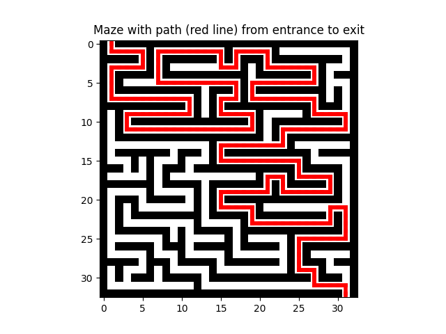
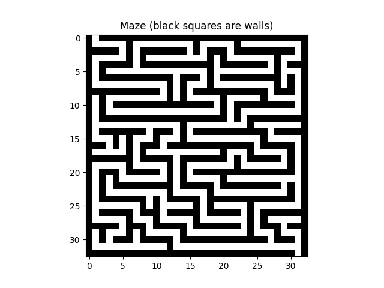
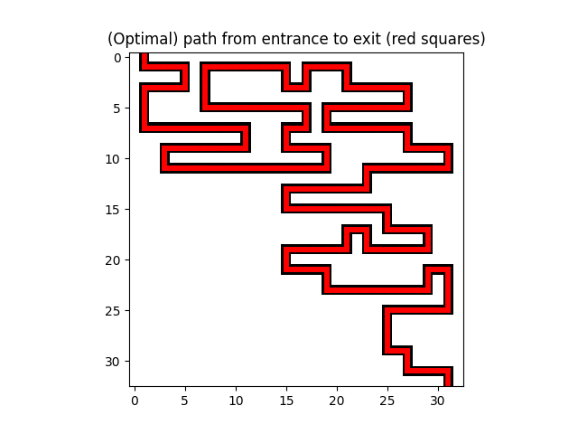

# VAE maze generation
>For the final assignment of the Generative AI Models course at TU/e, we implement a novel approach & evaluations for utilizing probabilistic models in maze generation. This repository contains the implementation of our approach.
<table>
  <tr>
    <td>Maze with solution</td>
    <td>Input x (Maze)</td>
    <td>Conditioning y (Path)</td>
  </tr>
  <tr>
    <td></td>
    <td></td> 
    <td></td>
  </tr>
</table>

## Maze generation with conditional VAEs

Generating mazes is no trivial task. There are many complicated and interesting algorithms, each generating unique mazes with different characteristics.

Inspired by the recent explosion in interest and quality of probabilistic (generative) models for image generation tasks, we create a novel approach for (conditional) maze generation with (Conditional) Variational Autoencoders.

Furthermore, we provide some new evaluation techniques for investigating the perceptual quality of generated mazes, and a framework for uncertainty quantification.

## Formal introduction
Given a dataset of $n$ mazes $X \sim p_\text{data}$ where each individual maze $x \in X$ consists of $D\times D$ pixels $x \in \{ 0, 1 \}^{D \times D}$. A pixel value of 1 indicates there is a wall, and 0 indicates no wall. 

Since generating large mazes can be time consuming, depending on the algorithm, we want to learn how to generate new mazes. To do so, we want to learn a distribution with parameters $\theta$, $p_\theta(x)$, that is similar to the real distribution. 

A common issue with mazes generated with probabilistic models is that they have multiple connected components (instead of one), and possibly do not have a path from start to finish. To address the former, we incorporate a term in the loss function to penalize 'islands'. To address the latter, we introduce a conditioning factor $y \in \{ 0, 1 \}^{D \times D}$ that marks a shortest path from the start to the finish with $1$'s. 
\
More formally, we want to generate samples $\hat x \sim p_\theta(x|y)$ where $\theta = \argmax_\theta \quad  p_\text{data}(x); \quad x \sim p_\theta(x|y)$. 

### Model

We experiment with conditional VAEs, with encoder

$q_\phi(z|x,y) \sim \mathcal{N}(\mu_\phi, \sigma^2_\phi)$

And decoder

$p_\theta(x|z,y) \sim \text{Bern}(\theta)$

where $x$ is the maze, $y$ is a path from start to finish.

With a learnable prior $p_\lambda(z)$.
- Note: With cVAEs, the prior can be formulated to be either conditioned on $y$ $p_\lambda(z|y)$ or we can say that the prior is independent of $y$: $p_\lambda(z)$. We chose the independent prior, because we want the latent space to learn stylistic elements of the maze, and should not (necessarily) encode the final path.


## Experiments
We are interested in how well the different VAE implementations do comparatively, over multiple datasets. These datasets are built using three different maze generation algorithms:
- RandomizedDFS (with bias)
- Prim's algorithm
- FractalTessellation

The code for generating these mazes can be found in the maze-algs submodule.

We implement 3 VAE parameterizations.
- Fully connected VAE
- Fully convolutional VAE
- Self-attention (transformer) VAE

There are three experiments.
- Style experiment
- Uncertainty experiment
- (General) visualizations

### Style experiment
Used to determine how well the different models perform on different datasets. 

Here, samples/reconstructions $\hat{x}$ are generated. We compute some statistic $m$ over the generated samples $m(\hat{x})$ and compare these statistics to the ground-truth statistics $m(x)$.

The following metrics can be used:
- mean branching factor: the number of directions you can travel to from any node (on average)
- mean ratio straight to curled paths
- mean number of connected components: should be 1, but generated mazes may have disjunct paths.
- mean exits: should be exactly 2 (one entrance, one exit)
- mean has_path: does the sample having a path from start to finish (on average)
- mean keeps $y$: does the sample (conditioned on $y$) keep the shortest path from the entrance to the exit (on average)
- mean number of cycles
- mean average shortest path length

### Uncertainty experiment
Probabilistic models provide a natural way of quantifying how certain they are in their predictions. In our setting, because the model outputs are probabilities, we define the model to be very certain (for a pixel) if the pixel has a probability close to 0 or 1, and uncertain if it is close to 0.5. The uncertainty score for one pixel $x_{ij}$ is define as:

$u(x_{ij}) := 1-2 \cdot |0.5 - P(x_{ij})| $

We overlay the uncertainty on the samples/reconstructions produced by each model on each dataset and plot them. These plots are used to determine where the models are uncertain, and how this aligns with the (perceptual) quality of the maze

### Visualizations
This experiment plots some ground-truth examples and model samples/reconstructions (for each model & dataset).

These visualizations give us insight into the (perceptual) quality of the generated samples/reconstructions.

## Running instructions
To train a model, use the `main.py` access point (in the root directory).

It supports the following arguments:

    -h, --help            show this help message and exit
    --config-path CONFIG_PATH
                        Path to the configuration file.

To change parameters for the model or training, update the YAML config file (at --config-path). configs/README.md contains the documentation for how to update the YAML configs.

An example run: \
```python main.py --config-path configs/fractal/FcVAE_config.yaml``` \
This will train the fully connected VAE on the FractalTessellation dataset, using the configuration specified at ```configs/fractal/FcVAE_config.yaml```

To run an experiment, use the `run_experiments.py` access point (in the root directory).

It supports the following arguments:

    -h, --help            show this help message and exit
    --experiment {style,visualizations,uncertainty}, -e {style,visualizations,uncertainty}
        The experiment to run, pick one of the above
    --datasets [{dfs,prim,fractal} ...], -d [{dfs,prim,fractal} ...]
        The datasets to use, specify a subset of the above
    --models, -m [{FcVAE,ConvVAE,TransformerVAE} ...]
        The models to use, specify a subset of the above
    --metrics, -met [{aggr_branching_factor,aggr_connected_components,aggr_count_holes_in_outer_wall,aggr_has_path,aggr_keeps_shortest_path,aggr_ratio_straight_to_curl_paths} ...]
        The metrics to use, specify a subset from the above
    --split {train,val,test}, -s {train,val,test}
        The dataset to use (train/val/test)
    --output-path 
        The output file path for the csv files (with style experiment)
    --n, -n
        Style experiment:
            The number of samples to compute statistics over (default=100)
        Visualizations/Uncertainty experiment:
            The number of samples/reconstructions to generate and visualize (default=4)

Example run: \
`python run_experiments.py -e style -d fractal -m FcVAE -met aggr_ratio_straight_to_curl_paths -n 100` \
To run the style experiment, with only the fractal FcVAE model, reporting only the ratio straight to curled paths, computed over 100 samples

More complex example run: \
`python run_experiments.py -e visualizations -d fractal prim dfs -m FcVAE TransformerVAE -n 4 `
Run the visualizations experiment, on all datasets, the fully connected and attention model, and produce 4 samples to plot.